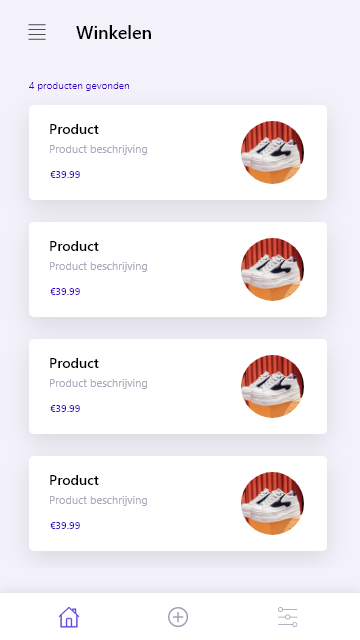
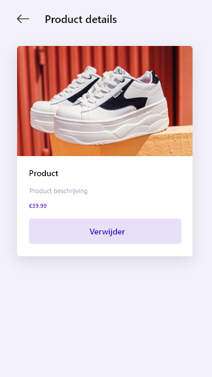
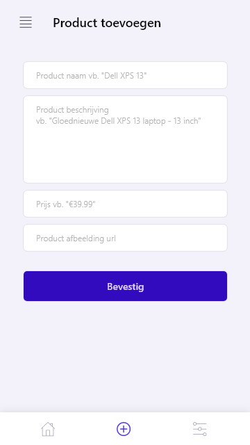
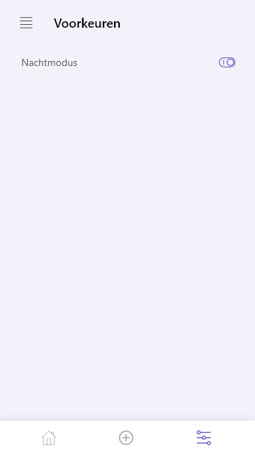

# Mobile Flutter Application

This repository contains the source code for the bachelor thesis [https://github.com/devrnt/bachelor-thesis](https://github.com/devrnt/bachelor-thesis)

## Information
This repository contains the following state management approaches:
* Scoped Model
* Provider
* BLoC with RxDart
* Redux
* MobX

The base code, containing widgets like a themed button and ainput field, can be found on the `master` branch. 
For every approach, listed above, is a branch created. Switch to the desired state management branch and run the Flutter application.

```
flutter run
```

## MobX
If any code for MobX is in need for change, run:
```
flutter packages pub run build_runner watch
```

## Demo
Product list        |  Product details
:-------------------------:|:-------------------------:
  | 

Add product        |  Preferences
:-------------------------:|:-------------------------:
  | 
